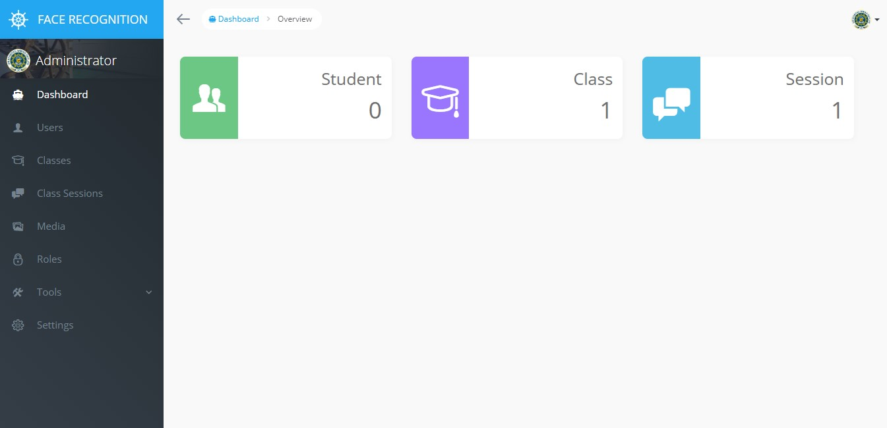

# Presence


### How to deploy
* Clone this repository
* Create a new env file `cp .env.example .env`
* Edit .env file (optional)
* Build the docker image `docker-compose build`
* Run the docker container `docker-compose up -d`
* Create an executable `chmod +x php-artisan`
* Create an executable `chmod +x composer`
* Update PHP package `./composer update`
* Generate key for laravel `./php-artisan key:generate`
* Migrate the table `./php-artisan migrate`
* Seed all Voyager settings `./php-artisan db:seed`
* Open browser, go to http://{docker_host}:8000

### Login
```
User : admin@presensi.uad.ac.id
Pass : admin
```